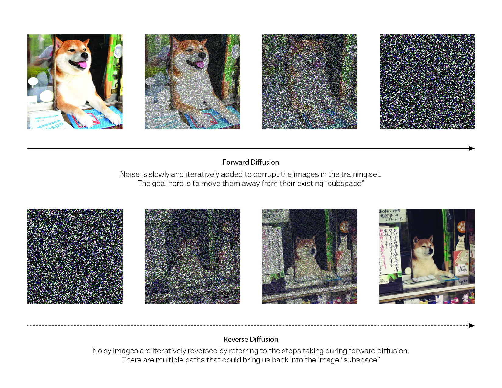

# Learning Goals
- After completing this course, students will be able to…
  - Understand the basics of how AI image generation works
  - Apply ethical and equity lenses to analyze relevant applications of this technology
  - Feel inspired, curious, and empowered to continue to explore this technology in the future

Take a minute to reflect and record any additional learning goals you have for yourself.

# In the news: Adobe
- Last week the [Federal Trade Commission sued Adobe](https://slate.com/technology/2024/06/adobe-ftc-lawsuit-hard-cancel-subscriptions-ai.html) (Photoshop, Illustrator, Acrobat software company) for predatory business practices
- This cast a light on recent criticism Adobe has received about the AI software **Adobe Firefly**
  - Firefly aims to be a leader in AI software for creative and artistic endeavors, providing a suite of tools including AI image generation
- Critics of Firefly wonder:
  - How does AI image generation fit into artist's workflows? Will it replace artist's jobs?
  - What resources did Adobe use to build Firefly?
  - Is information about Firefly transparent and available?
  - Does Firefly produce low quality or harmful images?

# How does AI image generation work?
- Requires two main components:
  1. A model (algorithm)
  2. Training data
  
# AI image generation: Model
- Leverages sophisticated models known as **deep learning**
  - **Bottom line: Deep learning is designed to mimic how the human brain works (think pattern recognition, learning networks)**
- Specific model (most often) stable diffusion

{width=600}

Image Credit: [University of Toronto Libraries](https://guides.library.utoronto.ca/c.php?g=735513&p=5297039)

# AI image generation: Training data
- Voluminous (i.e. millions of images) (e.g. [Adobe Firefly was trained on 300 million images](https://www.fastcompany.com/90951954/as-firefly-leaves-beta-adobe-promises-bonuses-to-creators-who-trained-its-ai#:~:text=While%20Adobe%20only%20trained%20Firefly,that%20was%20now%20their%20competition))
- Currently, most widely-available models are trained on a general set of images
  - Likely to change in the future
  - Specificity is an advantage of custom solutions
- Images or concepts that are less frequent (or nonexistent) in the training data are less likely to surface
  - Creates bias

# AI image generation: Training data
- Voluminous (i.e. millions of images) (e.g. [Adobe Firefly was trained on 300 million images](https://www.fastcompany.com/90951954/as-firefly-leaves-beta-adobe-promises-bonuses-to-creators-who-trained-its-ai#:~:text=While%20Adobe%20only%20trained%20Firefly,that%20was%20now%20their%20competition))
- Currently, most widely-available models are trained on a general set of images
  - Likely to change in the future
  - Specificity is an advantage of custom solutions
- Images or concepts that are less frequent (or nonexistent) in the training data are less likely to surface
  - Creates bias

Images created by DALL-E mini prompt: "fork under a plate"
{width=600}

# AI image generation in the wild
- Popular AI image generation technologies:
  - Adobe Firefly
  - Microsoft Co-pilot
  - DALL-E 3 (and DALL-E mini)
  - Midjourney
  - [Additional technologies](https://mitsloanedtech.mit.edu/ai/tools/images/)
  
# Knowledge Check
- Questions?
- Where have you encountered AI image generation? Have you used any AI image generation technologies?

# Should I use an AI image generation tool?
- Critically consider: For what purpose am I using AI image generation?
  - Is there precedent or guidance to use AI image generation in this way?
- Is reproducibility a concern for my use?
  - **AI image generation is largely not reproducible** (i.e. images are generated with a degree of randomness)
- Do I have any computational constraints? Cost constraints?
- Do I need to build my own custom model or can I use an existing solution? Are existing models transparent?
  - Explainable AI
  - Black box vs white box models, open source models

# Ethics and equity lenses: AI image generation
- Training data
  - Was the training data collected ethically?
  - Is the training data biased in a way that will produce harmful outcomes?
- Consider transparent, explainable alternatives
  - **Consult documentation**
  - **It is a bad sign if there is no documentation or documentation is sparse**
- Is there equity of access to AI image generation tools?

# [University of Toronto's VALID-AI](https://guides.library.utoronto.ca/image-gen-ai/critical-evaluation)
V: Validate data

A: Analyze algorithms

L: Legal and ethical considerations

I: Interpret how it works

D: Diversity and bias

A: Accuracy check

I: You

# Activity
[Jamboard](https://jamboard.google.com/d/1bXWisOiuy1Uvxc24HXrGR6kB7LKAYm9S59BUZ_OfYgU/edit?usp=sharing)

Engage with each (purposefully vague!) scenario by asking a question or making a comment. What  questions or considerations come to your mind?

Hint: If you're stuck visit
[University of Toronto's VALID-AI](https://guides.library.utoronto.ca/image-gen-ai/critical-evaluation)

# Scenario 1. You are putting together a presentation for a group of students. You would like to include a technical diagram, but you don't find anything useful through standard image repositories. You consider that you could use an AI image generation tool for this task.

# Scenario 1. 
- [What is the guidance on AI generated images in education? ](https://mitsloanedtech.mit.edu/2024/03/06/supporting-learning-with-ai-generated-images-a-research-backed-guide/)
- Which model is appropriate for this task?
- What is the training data for the selected model?
- How can I transparently report that I’m using AI image generation?
- What is the context of my presentation?
- What is the benefit to the audience?

# Scenario 2. You are a member of a research team. Your team recently finished collecting and analyzing data for your experimental trial. One of your team members offers to feed the data into an AI tool to efficiently generate figures. 

# Scenario 2. 
- [What is the guidance on using AI tools to generate figures?](https://midas.umich.edu/generative-ai/data-analysis-guide/
)
- Which model is appropriate for this task?
- What is the training data for the selected model?
- Do we have permission to release the experimental data to a generative AI tool?
- What will the figures be used for? Are they drafts or final?
- How will we validate the figures?

# Wrap up
Write down one question you still have about AI generated images and one resource you can consult to answer your question.

# Additional Resources
Internal UCSF Library Staff and Resources

**Friendly Overview**

[Vox Media's AI art, explained](https://www.youtube.com/watch?v=SVcsDDABEkM&pp=ygUhaG93IGRvZXMgYWkgaW1hZ2UgZ2VuZXJhdGlvbiB3b3Jr)

**Dig Deeper**

[University of Toronto's Artificial Intelligence for Image Research](https://guides.library.utoronto.ca/c.php?g=735513&p=5297039)

[Massachusetts Institute of Technology's 3 Questions: How AI Image Generators Work](https://www.csail.mit.edu/news/3-questions-how-ai-image-generators-work)

[New York University's Machines and Society LibGuide - Image Generation Tools](https://guides.nyu.edu/data/ai-image-generation)

[Massachusetts Institute of Technology's AI Image Generation Tools](https://mitsloanedtech.mit.edu/ai/tools/images/)

[University of Michigan's Using Generative AI for Scientific Research](https://midas.umich.edu/generative-ai-user-guide/)

**Dig Deepest**

[Hugging Face](https://huggingface.co/docs)

# Teaching Debrief

# Frameworks
-   Backwards/Integrated Course Design
    -   Developed by Fink (2003)
    -   A model for understanding how situational factors, learning goals, feedback and assessment, and teaching/learning activities are interrelated
-   Universal Design for Learning
    -   Developed by CAST (2018)
    -   A framework for inclusive teaching that treats engagement
        ("why"), representation ("what"), and expression ("how")

# Planning Process: Begin with Situational Factors
-   Fink (2003)
-   "What is the special instructional challenge of this particular
    course?"
-   "How does this course fit into the larger curricular context?"

# Planning Process: Begin with Situational Factors

-   \~25 students, non-technical UCSF community members (faculty, students, librarians)
-   Library workshop, one 20 minute session
-   Over zoom (in person and hybrid considerations)
    -   To adapt the session: Lean into tools that allow attendees to convene in the same space
    -   Invest in creating artifacts of the workshop
- Address accessibility *
   -   Emphasize approachable exploration of content
   -   Openly accessible materials
   -   Accommodations for low vision, hard of hearing
        -   Consult best practices

# Planning Process: Learning Goals

-   Fink (2003)
-   “What would I like the impact of this course to be on students, 2-3 years after the course is over?"
-   "What would distinguish students who have taken this course from students who have not?”
-   Moving from content centered to learning centered
-   Using Fink's taxonomy of significant learning
      - Foundational knowledge, application, and learning how to learn

# If I had more time I would...

- Dedicate more time to active learning and discussion
  - Fink (2003)\
  - "In what kind of situation do I expect students to need, or to be able to use this knowledge?"
  - Add a variety of scenarios to address new context (e.g. data collection, ethical ambiguity)
- Introduce and use relevant frameworks
  - University of Toronto's VALID-AI
  - Data Science Framework
  - Data Science Ethos
- Weave in individual information autonomy (data literacy)

# References

Fink, L. D. (2003). A self-directed guide to designing courses for
significant learning. University of Oklahoma, 27(11), 1-33.  

CAST (2018). Universal Design for Learning Guidelines version 2.2.
Retrieved from <http://udlguidelines.cast.org> Knuth, D. E. (1984).
Literate programming. The computer journal, 27(2), 97-111.  

Boenig-Liptsin, M., Tanweer, A., & Edmundson, A. (2022). Data Science
Ethos Lifecycle: Interplay of Ethical Thinking and Data Science
Practice. Journal of Statistics and Data Science Education, 30(3),
228–240. <https://doi.org/10.1080/26939169.2022.2089411>  

Keller, S. A., Shipp, S. S., Schroeder, A. D., and Korkmaz, G. (2020),
“Doing Data Science: A Framework and Case Study,” Harvard Data Science
Review, 2. DOI: 10.1162/99608f92.2d83f7f5.

